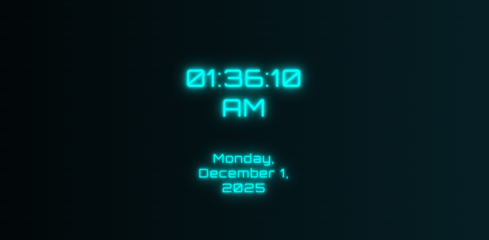

# 🌌 Neon Digital Clock  
A modern, animated **Neon Digital Clock** built using **HTML, CSS, and Vue.js**.  
It features a glowing cyberpunk-style UI, smooth background animations, and a responsive design that looks stunning on all screen sizes.

### Preview: [Visit Website](https://zarscape.github.io/neon-clock/)

---

## ✨ Features

- ⚡ **Real-time Clock** (updates every second)  
- 🕒 **12-hour format** with AM/PM  
- 📅 **Dynamic Date Display** (Day, Month, Year)  
- 🌈 **Neon Animated Text** with glowing effects  
- 🎨 **Gradient Animated Background**  
- 📱 **Fully Responsive**  
- ⚙️ **Lightweight** — only Vue.js (CDN) and CSS animations  

---

## 📂 Project Structure

```
📦 neon-clock
├── index.html
├── css/
│   └── style.css
└── js/
    └── script.js
```

---

## 🚀 How to Use

1. **Clone the repository**
   ```bash
   git clone https://github.com/ZarScape/neon-clock.git
   ```

2. **Open `index.html` in your browser**  
   No installation or build tools required.

---

## 🧩 Code Overview

### **HTML**
- Vue.js CDN  
- Neon text elements  
- Centered responsive layout  

### **JavaScript (Vue.js)**
- Updates time every second  
- Converts to **12-hour format**  
- Handles weekday & month names  

### **CSS**
- Neon glowing text animation  
- Gradient background animation  
- Responsive font scaling  
- Cross-browser text clipping  

---

## 🎥 Preview

> *Add a screenshot or GIF here*  
Example:  


---

## 🔧 Tech Used

- **HTML5**
- **CSS3**
- **Vue.js 2**
- **Google Fonts – Orbitron**


---

## 📜 License

This project is licensed under the **MIT License**.  
© 2025 **Muhammad Abuzar (ZarScape)**
